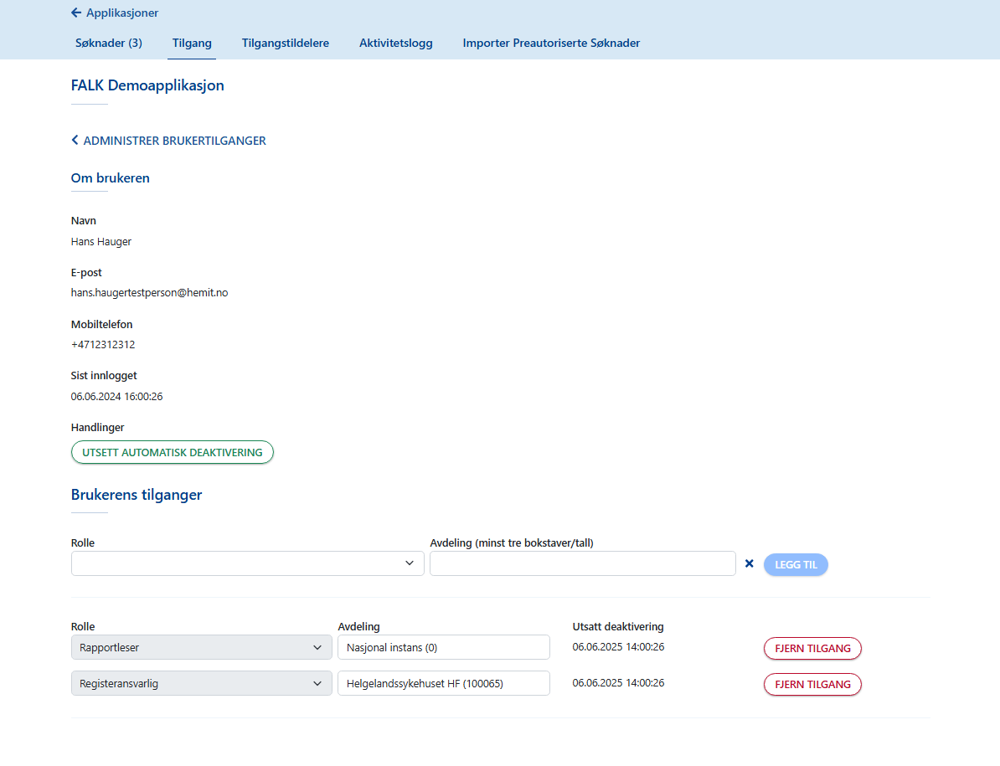
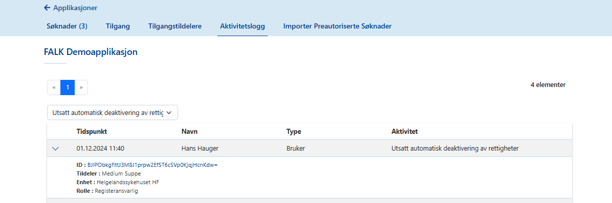

# Brukerveiledning for App Admin

INNHOLDSLISTE
<!-- vscode-markdown-toc -->
* [Applikasjoner](#Applikasjoner)
	* [Tilgang](#Tilgang)
		* [Laste ned brukerliste (CSV)](#LastenedbrukerlisteCSV)
		* [Laste ned tilgangshistorikk](#Lastenedtilgangshistorikk)
	* [Administrere brukere](#Administrerebrukere)
	* [Deaktivere og reaktivere brukere](#Deaktivereogreaktiverebrukere)
* [Tilgangstildelere](#Tilgangstildelere)
* [Importere Preautoriserte Søknader](#ImporterePreautoriserteSknader)

<!-- vscode-markdown-toc-config
	numbering=false
	autoSave=true
	/vscode-markdown-toc-config -->
<!-- /vscode-markdown-toc -->

---

## Innlogging

[Klikk her for veiledning for innlogging.](LoggInn.md)

Applikasjonsadministrator, App Admin, har samme rettigheter som en [Tilgangstildeler](Brukerdokumentasjon-tilgangstildeler.md)
I tillegg har Applikasjonsadministrator tilgang til å se og administrere tilgangstildelere for applikasjoner, og til å importere forhåndsautoriserte søknader om tilgang. Det vil si at når du er Applikasjonsadministator i Falk og åpner en applikasjon, ser du fanen Tilgangsdelere og Importer Preautoriserte Søknader, i tillegg til fanene Egenskaper, Søknader og Tilgang. 

## Applikasjoner
### Tilgang  
Når du velger fanen Tilgang får du opp en oversikt som viser brukere som har tilgang til applikasjonen. 
Merk at denne oversikten blir vist i en egen fane som heter Brukere, med en fane som heter M2M-klienter i bakgrunnen, når pålogget bruker er en FALK Administrator.

Oversikten som brukere har søkefelt og felt for å velge å filtrere brukerne på en bestemt enhet/avdeling eller alle enheter, i kombinasjon med en bestemt rolle eller alle roller. 

Når du søker etter en bruker må du skrive minst tre tegn i søkefeltet. Oversikten blir oppdatert til å vise søkeresultatet etterhvert som du skriver tre tegn eller mer i søkefeltet. 

#### Laste ned brukerliste (CSV)
I fanen Tilgang har du mulighet til å laste ned oversikten som viser brukere til en fil i CSV-format med funksjonen Last ned brukerliste (CSV). 

Når du velger funksjonen kan du hente ut oversikt over alle brukere per applikasjon. 

#### Laste ned tilgangshistorikk
I fanen Tilgang har du mulighet til å hente ut en liste som viser de brukerne som har hatt tilgang til applikasjonen i en bestemt periode. 

Når du velger funksjonen Last ned tilgangshistorikk åpnes et skjema for å velge hvilken enhet du vil se historikk for og felt for å velge fra-dato og til-dato. 

Når du har valgt alle enheter eller en bestemt enhet, og valgt en periode ved å velge fra-dato og til-dato, så velger du Last ned. Dette genererer en fil i CSV-format. Denne filen viser brukere som har hatt tilgang til applikasjonen på den enheten eller alle enheter, i den perioden du har valgt. 

Merk at tilgangstildelere ikke er inkludert i tilgangshistorikk. En oversikt som viser tilgangstildelere har du mulighet til å laste ned i fanen Tilgangstildelere. 

### Administrere brukere
I oversikten som viser brukere per appplikasjon blir hver bruker vist som en rad og med knappen Administrer. Administrer-knappen kan du velge for å få mer informasjon om en bruker og administrere brukerens tilganger. 

Når du velger knappen Administrer for en bruker kommer du til siden som viser informasjon om brukeren. På siden blir navn og kontaktinformasjon til brukeren vist, sammen med det tidspunktet denne brukeren logget på applikasjonen sist. 
På siden er det også en liste som viser Brukerens tilganger. Her kan du gi brukeren tilgang til kombinasjoner av enheter og roller og fjerne eksisterende tilganger som brukeren har. 

### Deaktivere og reaktivere brukere
En bruker som ikke har logget inn i løpet av en gitt periode kan bli automatisk deaktivert. Hvor lang tid det går før den eller de rettighetene brukeren har blir deaktiverte er satt til seks -6- måneder. 

l

Som Applikasjonsadministrator kan du utsette deaktiveringen av rettigheter en bruker er i ferd med å få deaktivert: 
- I fanen Tilgang for applikasjonen, velg Admininstrer for brukeren for å komme til siden som viser informasjon om brukeren sammen med funksjonen Utsett automatisk deaktivering. 
- For å hindre at brukerens rettigheter blir deaktivert, velg Utsett automatisk deaktivering. 
- I listen som viser Brukerens tilganger blir for hver rolle og avdeling som brukeren har rettighet til oppdatert med tidspunkt for neste deaktivering, for eksempel 365 dager fra tidspunktet du velger Utsett automatisk deaktivering. 

Du kan gå til fanen Aktivitetslogg for applikasjonen og finne aktiviteten i aktivitetsloggen som viser at du har utsatt deaktivering av rettigheter som brukeren har til applikasjonen. Ved å klikke på aktiviteten blir den utvidet og viser mer informasjon. 

På siden som viser informasjon om brukeren kan du få opp informasjon om at en bruker har tilganger som er deaktivert. Som applikasjonsadministrator har du mulighet til å reaktivere: 
- I listen som viser brukerens tilganger er knappen Reaktiver tilgjengelig for rollen og avdelingen.
- Klikk Reaktiver. 
Etter at du har reaktivert tilgangen for brukeren blir tilgangen oppdatert og aktiv igjen. 

## Tilgangstildelere
I fanen Tilgangstildelere har du en oversikt som viser personer som har rollen som tilgangstildeler for applikasjonen, med personens kontaktinformasjon.
Med knappen Last ned tilgangstildelere (CSV) kan du velge å laste ned oversikten med alle tilgangstildelere som en liste i CSV-format.

Hvert innslag i oversikten kan du utvide ved å klikke på navnet eller på pilen til innslaget. Når du har valgt å utvide et innslag får du oversikt over hvilke enheter personen er tilgangstildeler for. 

Nedenfor oversikten som viser tilgangstildelere er det søkefelt du kan bruke til å søke opp og legge til nye tilgangstildelere for applikasjonen. 

For å legge til en ny tilgangstildeler kan du skrive inn et navn, epostadresse eller telefonnummer i søkefeltet. Søkeresultatene blir vist som en liste under søkefeltet, og dersom ingen brukere er funnet, får du informasjon om dette. 

Herfra kan du endre hvilke enheter personen skal være tilgangstildeler for: 
Du kan  fjerne en tilgang som har vært gitt, og du kan legge til tilgang til en og en enhet, eller velge Alle enheter. 

Under oversikten som viser tilgangstildelere har du mulighet til å søke opp en person og gjøre denne til tilgangstildeler for en eller flere enheter. Hvilke enheter som er tilgjengelige og kan velges er bestemt av tilgangstreet som er satt opp for applikasjonen, i fanen Egenskaper. 

## Importere Preautoriserte Søknader
I fanen Importer Preautoriserte Søknader er det en tekstboks hvor du kan legge inn et json-objekt.

Det json-objektet som du kan legge inn, må inneholde en liste over personer og hvilke rettigheter disse personene skal ha til applikasjonen. 

Et eksempel på et json-objekt kan være følgende: 

    {
        "OrderDescription": "This is an order",
        "PreAuthorizedOrders": [{
            "PersonIdentifier": "17078614919",
            "FirstName": "Putte",
            "LastName": "Andresen",
            "PhoneNumber": "99887766",
            "Email": "putte.andresen@hemit.no",
            "Claims": [{
                    "Type": "http://schemas.microsoft.com/ws/2008/06/identity/claims/role",
                    "Value": "Pasientansvarlig"
                },
                {
                    "Type": "http://schemas.hemit.no/Hemit/Mqr/Claims/AuthorizedForOrganizationalUnit",
                    "Value": "100320"
                }
            ]
        }]
    }

Når du har lagt inn et json-objekt i tekstboksen og velger Lagre, vil du se en tilbakemelding skjermen når importen er utført.

---

>[ Til forsiden i Falk brukerveiledning](README.md)

>[ Til veiledning for innlogging](LoggInn.md)

>[ Brukerveiledning for App Admin](Brukerdokumentasjon-applikasjonsadmin.md)

>[ Brukerveiledning for Bruker](Brukerdokumentasjon-bruker.md)

>[ Brukerveiledning for Falk Administrator](Brukerdokumentasjon-falkadmin.md)

>[ Brukerveiledning for M2M-klienter](Brukerdokumentasjon-m2m.md)

>[ Brukerveiledning for Tilgangstildeler](Brukerdokumentasjon-tilgangstildeler.md)

>[ Til toppen av denne siden](#brukerveiledning-for-app-admin)