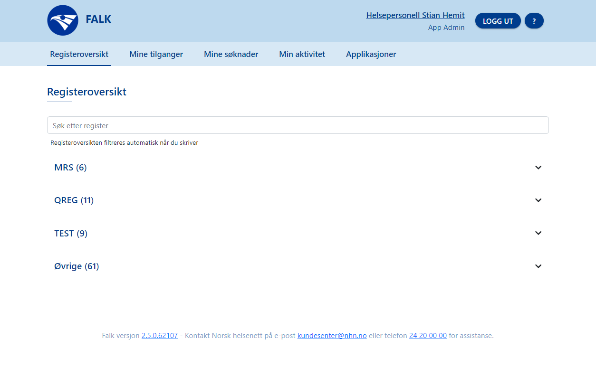

# FALK Brukerdokumentasjon

# Brukerveiledning for brukere

INNHOLDSLISTE
<!-- vscode-markdown-toc -->
* [Innlogging](#Innlogging)
* [Søk om tilgang](#Skomtilgang)
* [Falk generelt](#Falkgenerelt)
	* [Menyen](#Menyen)
* [Registeroversikt](#Registeroversikt)
	* [Merke et register som favoritt](#Merkeetregistersomfavoritt)
* [Mine tilganger](#Minetilganger)
* [Mine søknader](#Minesknader)
* [Min aktivitet](#Minaktivitet)
* [Bruker-profil](#Bruker-profil)
* [Deaktivert tilgang](#Deaktiverttilgang)
* [Reaktivere en dekativert tilgang](#Reaktivereendeaktiverttilgang)

<!-- vscode-markdown-toc-config
	numbering=false
	autoSave=true
	/vscode-markdown-toc-config -->
<!-- /vscode-markdown-toc -->

---

SØK PÅ DENNE SIDEN

Du kan søke etter informasjon på denne siden med Ctrl+ F: 
- Trykk Ctrl+F for å få opp søkefeltet.
- I søkefeltet skriver du det vil søke etter.
- Søketreff blir uthevet med en annen bagrunnsfarge.  

---

## Innlogging
[Klikk her for veiledning for innlogging.](LoggInn.md)

## Bruker i Falk

## Søk om tilgang
I Falk kan du gå til direkte til et register ved å velge registeret i listen som viser alle registre. Når du klikker på registerert i listen utvides det og viser knapper for å søke tilgang og for å gå til registeret. 
For å gå direkte til registeret, velg Gå til registeret. 

Når du velger Gå til registeret og du ikke har tilgang til dette registeret, kommer du til siden for å søke om tilgang til registeret. I skjemaet fyller du inn informasjon om hva du trenger for å informere tilgangstildeler som mottar søknaden om hvilken rolle de skal gi og til hvilken avdeling.

Når skjemaet er ferdig utfylt kan du sende inn skjemaet ved å velge knappen Send inn. Etter at du har sendt søknaden vil du få informasjon om søknaden du har sendt med oppsummering av søknaden. Du vil også få tilsendt en epost på epostadressen du har oppgitt i søknaden, om at søknaden er sent til behandling.

På siden som viser informasjon om at søknad er sendt inn har du mulighet til å gå til Falk-forsiden som viser registrene, eller sende inn en ny søknad om tilgang til samme applikasjon: 
- Klikk Gå til oversikt for å komme til siden som viser alle registrene.
- Klikk Ny søknad for [applikasjonsnanv] for å få opp skjemaet og sende inn søknad om flere tilganger til appliaksjonen.

Du kan også velge å se oversikten over alle søknadene du har sendt som viser status for hver søknad i en liste: 

 

Søknadene er ordnet etter søknadsdato med den nyeste søknaden øverst. Hver rad i oversikten tilsvarer en søknad, og fargen på hver rad tilsvarer statusen søknaden har nå: 
- Gul farge: Søknaden er venter på behandling og status er Til behandling.
- Rød farge: Søknaden er avvist av en tilgangstildeler og status er Avslått.
- Grønn farge: Søknaden er behandlet og du har fått tildelt den tilgangen du har søkt om, og status er Godkjent.

## Falk generelt
### Menyen
Når du har logget inn i Falk har du en meny øverst på skjermen. Menyen viser Falk-logoen til venstre og på høyre side vises navnet ditt, knappen Logg ut og et ikon med spørsmålstegn helt til høyre. 

Du kan klikke på navnet ditt til på menyen for å få opp din bruker-profil.

Når du klikker på Logg ut-knappen blir du logget ut av Falk.

Ikonet med spørsmålstegn [?] som vises lengst til høyre i menyen har en lenke til brukerveiledningene. Når du klikker på ikonet blir brukerveiledningene åpnet i en ny fane.

Under menyen vil du se forskjellige faner som gir deg tilgang til oversikter og funksjoner i Falk, for eksempel:
- Registeroversikt
- Mine tilganger
- Mine søknader
- Min aktivitet
- Applikasjoner (tilgjengenglig for Applikasjonsasministrator og Tilgangstildeler)
- Administrere (tilgjengenglig for Falk Administrator)

Når du velger en fanen blir den åpnet som en ny side eller skjema i Falk. 

## Registeroversikt
Registeroversikt er den første siden du kommer til når du logger inn i Falk. Dette er en fane som viser alle applikasjonene (registrene) som finnes i Falk. 

Øverist i registeroversikten har du et søkefelt. Når du begynner å skrive i søkefeltet blir registeroversikten oppdatert til å vise applikasjoner (registre) og applikasjonskategorier som samsvarer med det du har skrevet i feltet. 

Applikasjonene i registeroversikten er ordnet i applikasjonskategorier. Hver applikasjonskategori vises med navnet sitt, antallet registre som tilhører applikasjonskategorien og en pil for å utvide og se alle registrene i denne applikasjonskategorien. Applikasjonskategoriene er søkbare, og du får treff på kategorier hvis du skriver navnet til en kategori i søkefeltet. 

For å se alle registrene i en applikasjonskategori, klikk på den slik at den utvides til å vise registrene. 
For å lukke en applikasjonskategori og bare se navnet til applikasjonskategorien, klikk på den på nytt. 

Hvert register i en appliksjonskategori blir vist med navnet til registerert (applikasjonen) sammen med en stjerne ved siden av navnet. 

### Merke et register som favoritt
Når du klikker på stjernen ved siden av et registernavn, blir registerert merket som en favoritt, stjernen blir fylt med farge og registerert blir vist øverst i registeroversikten. 
For å fjerne en favorittmerking for et register klikker du på stjernen slik at den ikke lenger er fylt og blir vist uten farge. 

## Mine tilganger
Fanen Mine tilganger viser en oversikt over hvilke applikasjoner (registre) du har tilgang til. Hvert register vises som en rad i oversikten. 

Når du klikker på raden for et register blir den utvidet til å vise hvilke tilganger du har, det vil si hvilke enheter og rollen du har ved hver enhet eller avdeling. 

## Mine søknader
I fanen Mine søknader har du en oversikt over søknader du har sendt inn. For hver søknad kan blir det vist informasjon om når du søkte og status på søknaden. Hvis en søknaden er behandlet står det når den ble behandlet, og hvis søknaden ble avvist kan det stå en kommentar.

Merk at

## Min aktivitet
Fanen Min aktivitet er en logg som viser aktiviteten din i Falk. Aktiviteter som blir loggført og vise i aktivitetsloggen her omfatter rettigheter som er lagt til, som er endret eller som har blitt slettet. I tillegg kan du finne når du har logget på og logget av applikasjoner (registre) som du har tilgang til.
Øverst i aktivitetsloggen har du en nedtrekksmeny som du gir deg mulighet til å vise alle aktiviteter eller bestemte typer aktivieteter, for eksempel Rettigheter lagt til eller Rettigheter slettet.

Noen aktiviteter som blir vist i loggen kan utvides til å vise mer informasjon. En slik aktivitet blir vist med en pil helt til venstre på raden for aktiviteten. Klikk raden for å utvide den og få tilgang til informasjonen.

## Bruker-profil
For å se din bruker-profil kan du klikke navnet ditt som er vist til høyre på menyen. 

Bruker-profilen viser kontaktinformasjonen som er registrert på din bruker. Under kontaktinformasjonen vises knappen Endre informasjon. For å oppdatere din kontaktinformasjon kan du klikke på knappen og få opp et skjema for å oppdatere mobilnummer og epostadresse, og velge om du vil ha epostvarsling aktivert eller deaktivert. Merk at hvis du velger å slå av og deaktivere epost-varsling vil du ikke lenger motta noen eposter om behandlede søknader. 

Har du endret på kontaktinformasjonen, husk å lagre endringene med å klikke Lagre endringer.

Brukerprofilen din viser også rettigheter du har: 
Nedenfor kontaktinformasjonen vil du ha listen Mine tilganger som viser hvert register (applikasjon) og hvilke roller du har ved hvilken enhet (avdeling).  

## Deaktivert tilgang
En tilgang du har hatt før, men som du ikke har nå, kan ha blitt deaktivert. Det er ikke nødvendig å søke om å få denne tilgangen på nytt. Du kan be om å få reaktiverte tilgangen i FALK. 

Hvis en tilgang har blitt deaktivert får du varsel om at den har blitt deaktivert i en epost når en epostadresse er registrert på brukeren din. 
Eksempel på varsel i epost om tilgang som har blitt deaktivert:

	Emne: Din tilgang til [Navnet til applikasjonen] er deaktivert
	Din tilgang til [Navnet til applikasjonen] er deaktivert på grunn av inaktivitet.
	Siste innlogging i [Navnet til applikasjonen] registrert 04.10.2024.
	Logg inn i FALK for å be om reaktivering.

For å se om en tilgang har blitt deaktivert kan du logge på i Falk, klikke på navnet ditt for å komme til din bruker-profil. En tilgang som har blitt deaktivert er merket med teksten Deaktivert og har en knapp for å be om reaktivering. 

## Reaktivere en deaktivert tilgang
Når du logger inn i FALK og velger brukerprofil-siden, kan du oversikten Mine tilganger. I oversikten er en deaktivert tilgang merket som deaktivert, og du kan be om å få reaktivert denne tilgangen. Du trenger ikke søke om tilgangen på nytt, istedenfor velger du knappen Be om reaktivering.

Etter at du har bedt om reaktivering av en tilgang blir det sendt en epost med varsel om at du har bedt om reaktivering, til den som er ansvarlig for å gi denne tilgangen. Tilgangstildeler for applikasjonen kan gjøre tilgangen aktiv igjen i brukeradministrasjon: I listen Brukerens tilganger kan Tilgangstildeler velge knappen Reaktiver som er vist sammen med den deaktiverte tilgangen.  

[Klikk her å gå til veiledningen for tilgangstildeler som kan reaktivere en deaktivert tilgang, i Brukerdokumentasjon for tilgangstildeler](Brukerdokumentasjon-tilgangstildeler.md#reaktiver-deaktivert-tilgang)

---

Mer informasjon og veiledninger:

>[ Til forsiden i Falk brukerveiledning](README.md)

>[ Veiledning for innlogging](LoggInn.md)

>[ Brukerveiledning for App Admin](Brukerdokumentasjon-applikasjonsadmin.md)

>[ Brukerveiledning for Bruker](Brukerdokumentasjon-bruker.md)

>[ Brukerveiledning for Falk Administrator](Brukerdokumentasjon-falkadmin.md)

>[ Brukerveiledning for M2M-klienter](Brukerdokumentasjon-m2m.md)

>[ Brukerveiledning for Tilgangstildelere](Brukerdokumentasjon-tilgangstildeler.md)

>[ Til toppen av denne siden](#Brukerveiledning-for-brukere)