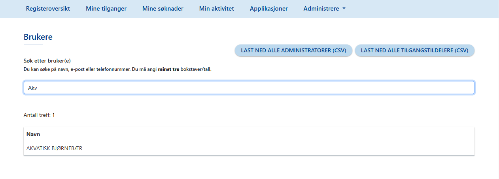

# Brukerveiledning for Falk Administrator

[Klikk her for veiledning for innlogging.](LoggInn.md)

## Innholdsliste: 
Varsler
Brukere
- Deaktivere og reaktivere brukere
M2M-klienter
API-ressurser
Registerkategorier
Applikasjoner
- Legg til ny applikasjon
- Egenskaper
- Klienter 

Falk Admininistrator har samme rettigheter som en [Applikasjonsadministrator].(Brukerdokumentasjon-applikasjonsadmin.md)
I tillegg har Falk Administrator fanen Administrere i Falk. Velg fanen Administrere for å se og velge hva du vil administrere: 
- Varsler
- Brukere
- M2M-klienter
- API-ressurser
- Registerkategorier
- Applikasjonstyper

## Varsler
Når du velger Varsler i Administrer-menyen, kommer du til en oversikt over varsler som er satt opp i Falk.
Disse varslene kan blir vist til alle brukere i Falk, hvis varslene er aktive.
Du har muligheten til å Legge til varsler, og til å endre og slette varsler herfra.

Klikk knappen Legg til nytt varsel for å opprette et nytt varsel. Skriv teksten varselet skal vise og velg den typen varsel det er: Enten Informasjon, Feil eller Advarsel. Hver type varsel blir vist med en egen farge og vises i det tidsrommet du setter opp. Klikk Lagre for å lukke skjemaet og legge til varselet. Varselet du har lagt til blir vist i oversikten som viser Varlser og du kan endre og slette det herfra. 

## Brukere
Når du velger menypunktet Brukere kommer du til en side med et søke-felt hvor du kan skrive inn navn og søke opp brukere i Falk. 
Over søkefeltet er det knapper for å laste ned en liste som kan vise alle administratorer og alle tilgangstildelere i Falk. Denne listen er en fil i CSV-format.  

For å søke etter en eller flere brukere må du skrive inn minst 3 tegn i feltet for å få et søkeresultat. Du kan søke på navn, epostadresse eller telefonnummer. 

Hvis du får treff på søket ditt, blir det vist i en liste. Klikk den brukeren i listen som du vil gå inn på. 

Når du har valgt en bruker får du vist kontaktinformasjon og knapper for å deaktivere brukeren, og for å endre informasjon om brukeren. 
Hvilke tilganger brukeren har og hvilke søknader brukeren har sendt ser du i egne faner.

### Deaktivere og reaktivere brukere
Falk Administrator har tilgang til å utsette deaktivering av tilganger og reaktivere tilganger som har blitt deaktivert for en bruker. Disse aktivitetene blir loggført som aktiviteter i Aktivitetsloggen for applikasjonen.  

[Klikk her å gå til veiledningen for å deaktivere og reaktivere brukere i Brukerdokumentasjon for Applikasjonsadmin.](https://vscode.dev/github/HemitSystemutvikling/Falk/blob/master/Brukerdokumentasjon-applikasjonsadmin.md#L45-L46)

## M2M-Klienter
For å se og administrere M2M-klienter, maskin-til-maskin-klienter, kan du velge M2M-klienter under Administrere. Du kan lese mer om funksjonaliteten ved å klikke på lenken [M2M](Brukerdokumentasjon-m2m.md)

## API-ressurser
For å se og administrere API-ressurser i Falk, kan du velge API-ressurser under Aministrere. Dette kan du lese mer om ved å klikke på lenken [M2M](Brukerdokumentasjon-m2m.md)

## Registerkategorier
Når du velger Registerkategorier finner du en liste over kategorier som applikasjonene i Falk kan bli ordnet inn i.

Du har mulighet til å legge til nye registerkategorier og endre eller slette eksisterende registerkategorier.

## Applikasjoner 
Som Falk Administrator har du oversikt over alle applikasjoner og kan admininstrere dem. Oversikten ser du når du velger fanen Applikasjoner. 

Over listen som viser applikasjoner vil du se et søke-felt hvor du kan skrive inn navn og søke opp en bestemt applikasjon. Du kan velge å se applikasjonene i listen i stigende eller fallende rekkefølge etter applikasjonsnavn eller scopenavn ved å klikke på pilene.

For å se og administrere en bestemt applikasjon kan du klikke på raden for applikasjonen i oversikten. 

### Legg til ny applikasjon

Som Falk Administrator kan du legge til nye applikasjoner i Falk. Ved å klikke knappen Legg til ny applikasjon i Applikasjoner-oversikten kan du opprette en ny applikasjon.

Når du velger Legg til ny applikasjon får du opp et skjema. Du fyller ut skjemaet og lagrer det for å opprette den nye applikasjonen. 

Du kan se applikasjonen du har lagt til i Applikasjoner-oversikten med navnet du har gitt den og scopenavnet du har fylt ut i skjemaet. 

Vil du åpne en applikasjon for å se og endre på den, kan du klikke raden til applikasjonen i Applikasjoner-oversikten. 

### Egenskaper

Når du velger en applikasjon i Applikasjoner-oversikten og åpner den, har du en fane som heter Egenskaper i fokus, og en fane som heter Klienter i bakgrunnen. Fanen Egenskaper viser informasjon og innstillinger for  applikasjonen. Disse kan du redigere ved å klikke Endre-knappen. 

Når du har gjort endringene du ønsker kan du lagre dem ved å klikke Lagre og får en bekreftelse om at applikasjonen er oppdatert på skjermen. 

### Klienter
Det er også en fane bak fanen Egenskaper, og det er fanen Klienter. I denne fanen kan du se klienter som er lagt til for applikasjonen og du kan du legge nye klienter. 

For hver klient er det knapper for å åpne klienten og gjøre endringer på den, for å sette at en klient er registrert uri, og for å slette klienten.

Når du velger knappen Legg til klient får du opp et skjema med felt du må fylle ut for å legge til den nye klienten. Når feltene er fylt ut klikker du Legg til i skjemaet for å lukke skjemaet og legge til klienten. Den nye klienten du har lagt til blir vist i listen i fanen Klienter. Pass på å klikke Lagre-knappen for å lagre klienter du har lagt til  applikasjonen. 

