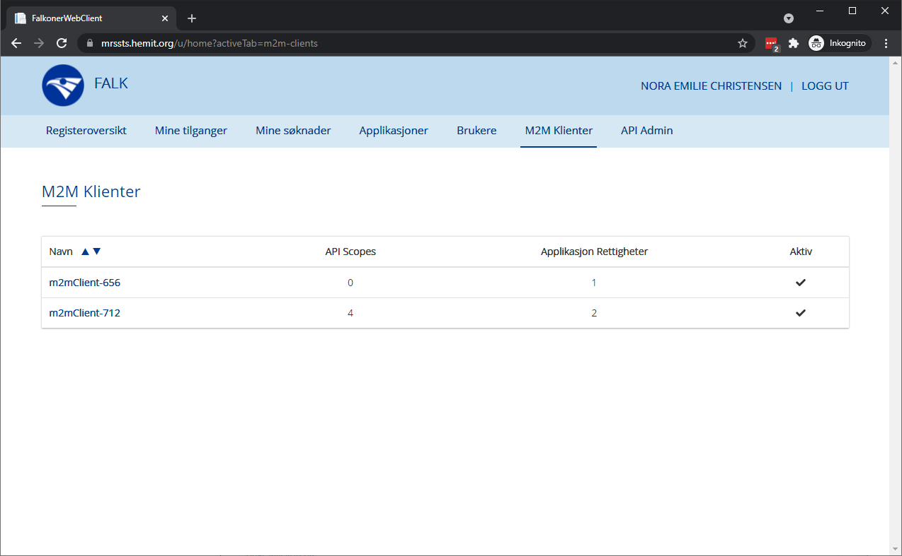
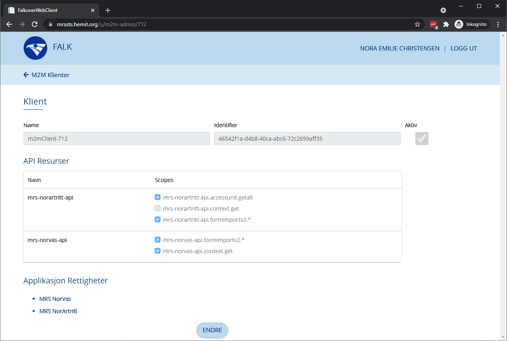
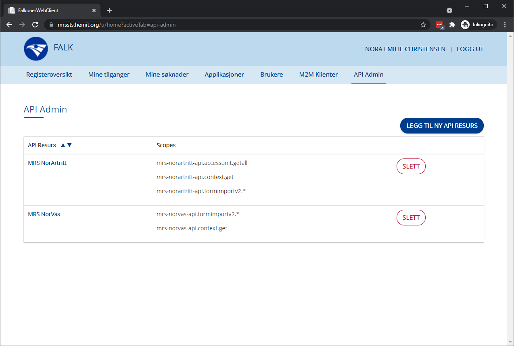
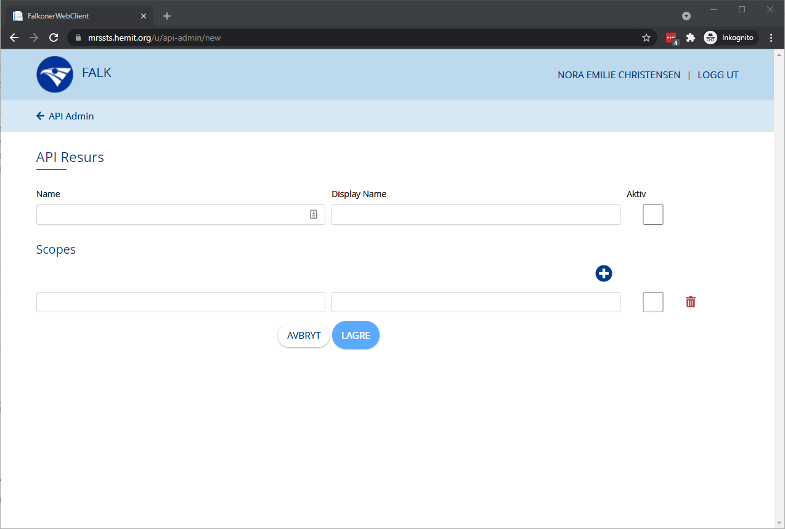
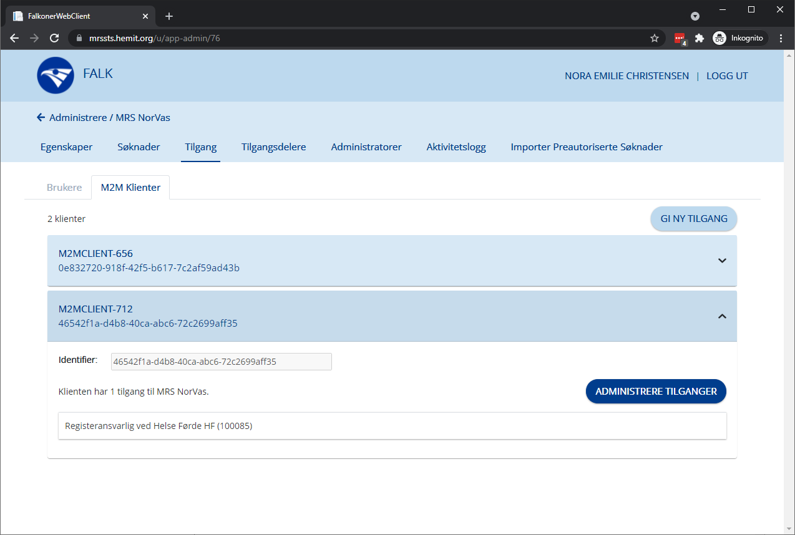
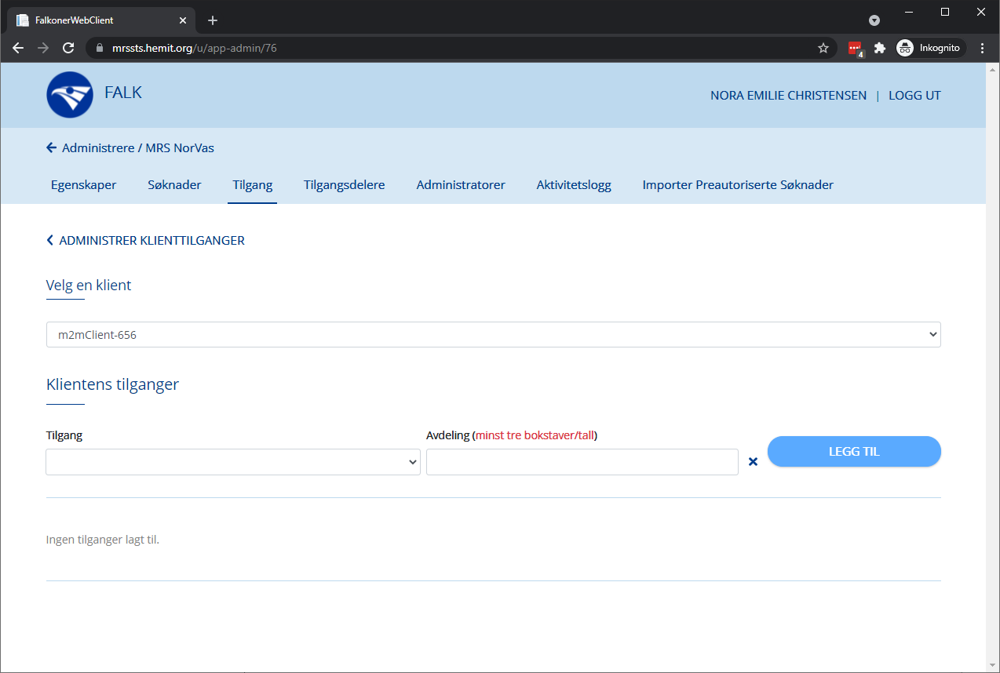

# Step-By-Step for M2M

[Klikk her for veiledning for innlogging.](LoggInn)

Det er bare Falk Admin som kan endre på M2M (Maskin til Maskin).

## Klienter
Falk Admin har en fane som heter "M2M Klienter". 
Her finner man en liste over alle M2M klientene i FALK, samt informansjon om de er aktive og hvor mange scopes og rettigheter de har.

Ved å trykke på en av klientene kommer man til en mer detaljert oversikt over hvilke scopes og rettigheter klenten har. Det er også her du kan endre på en klient.

## API Admin
Falk Admin har også en fane som heter "API Admin". Her finner man en oversikt over alle API resursene som finnes i FALK.

Man kan legge til en ny API resurs ved å Trykke på "Legg til ny API resurs"-knappen.
Fyll ut Name, Display Name og en eller flere scope key og value. 

## Tilgang
Tilgang fanen på en applikasjon er nå delt opp i Brukere og M2M klienter. Under M2M klienter ligger det en liste med klienter som har en eller flere tilganger til applikasjonen.
Ved å klikke på en klient får man informasjon om hvilke tilganger den har. Ved å trykke på "Administrer tilganger"-knappen på en klient, kan man gi og fjerne tilganger.

Man kan legge til en ny tilgang ved å trykke på "Gi ny tilgang"-knappen. Dette krever at det finnes klienter som ikke allerede har tilgang til applikasjonen.

