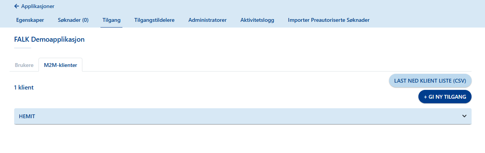
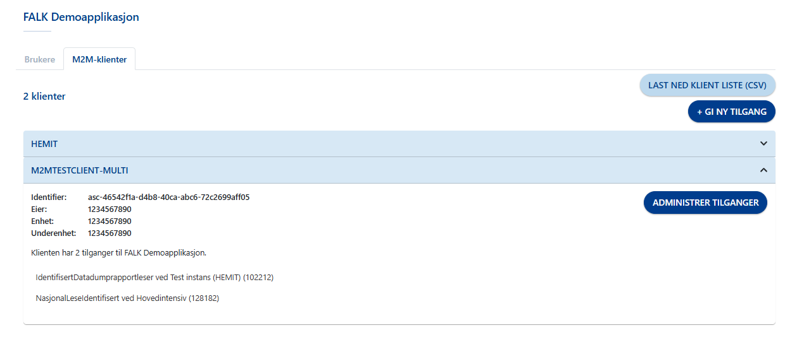
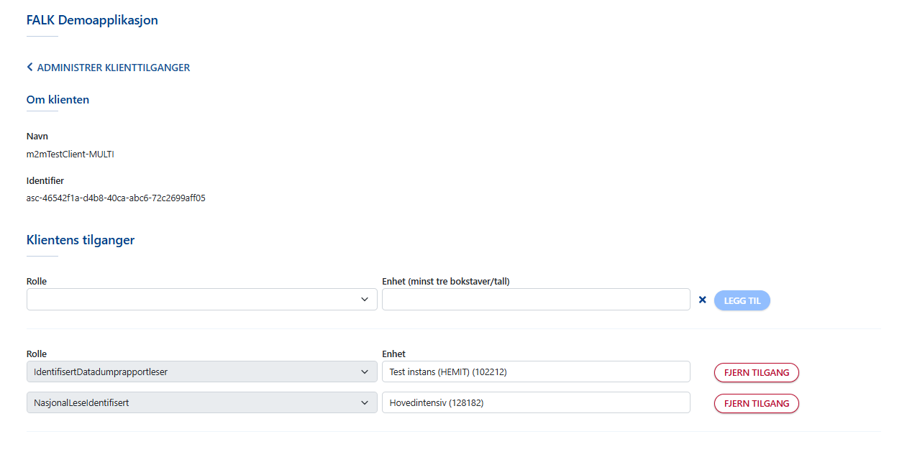
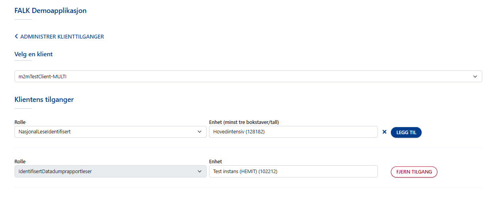

# FALK Brukerdokumentasjon

# Brukerveiledning for M2M-klienter

INNHOLDSLISTE
<!-- vscode-markdown-toc -->
* [M2M-klienter](#M2M-klienter)
* [API-ressurser](#API-ressurser)
	* [Legg til ny API-ressurs](#LeggtilnyAPI-ressurs)
* [Tilgang](#Tilgang)
* [Administrer klienttilganger](#Administrer-klienttilganger)
* [Gi ny tilgang for M2M-klient](#Gi-ny-tilgang)

<!-- vscode-markdown-toc-config
	numbering=false
	autoSave=true
	/vscode-markdown-toc-config -->
<!-- /vscode-markdown-toc -->

---

SØK PÅ DENNE SIDEN

Du kan søke etter informasjon på denne siden med Ctrl+F: 
- Trykk Ctrl+F for å få opp søkefeltet.
- I søkefeltet skriver du det vil søke etter.
- Søketreff blir uthevet med en annen bagrunnsfarge.  

---

## Innlogging
[Klikk her for veiledning for innlogging.](LoggInn.md)

Det er bare Falk Administrator som kan sette opp og aktivere Maskin til Maskin-klienter.

## M2M-klienter
Falk Admininistrator har et menyvalg i fanen Administrere for å se og administrere maskin til maskin-klienter: M2M-klienter. 

Når du velger M2M-klienter vil du få opp siden som viser oversikten over M2M-klientene i Falk. Du kan bruke søkefeltet på siden for å søke etter en M2M-klient.  
Hver M2M-klient blir vist som en rad i oversikten. For hver klient vises antall API-scopes og hvor mange applikasjoner M2M-klienten har tilgang til. I tillegg kan du se om en M2M-klient er aktiv.

Velg en M2M-klient i oversikten for å åpne den og få opp mer informasjon om M2M-klienten. Fanen Konfigurasjon er i fokus når du åpner klienten og viser 
- navnet til klienten, identifikatoren og avkryssingsboksen som viser om M2M-klienten er aktiv eller inaktiv, 
- listen API-ressurser som viser de API-ressursene som finnes, hvilke scopes som er satt opp og som er aktive eller inaktive for hver API-ressurs, 
- listen Applikasjoner som viser navnet til de applikasjonene som er satt opp med denne klienten. Du kan klikke på navnet til applikasjonen for å navigere til direkte til applikasjonen herfra.  

 
I fanen Konfigurasjon for M2M-klienten har du også knappen for å endre på M2M-klienten. Når du velger knappen Endre blir M2M-klienten åpnet for redigering og gir tilgang til knapper du kan bruke til å avbryte redigeringen, slette M2M-klienten eller lagre endringer du har gjort. 

Når du velger å endre på en M2M-klient får du tilgang til å velge ett eller flere scopes som skal brukes for hver API-ressurs: Huk av avkryssingsboksen for et scope som skal være tilgjengelig og aktivt, og fjern avkryssingen i avkryssingsboksen for å gjøre et scope utilgjengelig. 

Når du er ferdig med å endre konfigurasjonen, velg Lagre-knappen for lagre endringene du har gjort. Endringer som er utført for M2M-klienten blir loggført i aktivitetsloggen. Du kan se disse å velge fanen Aktivitetslogg. 

Hvis du velger fanen Kontakt får du opp en oversikt som viser registrerte kontakter for M2M-klienten og tilgang til funksjonen for å legge til ny kontakt. 

Når du velger å legge til en ny kontakt må du oppgi navn og epostadresse, i tillegg kan du registrere organisasjon og telefonnummer. Hver kontakt blir vist i fanen Kontakter og kan slettes eller endres.  

I fanen Konfigurasjon har du tilgang til å slette M2M-klienten ved å velge Slett-knappen. M2M-klienten blir slettemerket i databasen. Applikasjoner som har gitt tilgang til en slettet M2M-klient viser fortsatt M2M-klienten og identifikatoren, i listen M2M-klienter i fanen Tilganger, men uten noen aktive tilganger. 

En M2M-klient som har blitt slettet kan tilbakeføres i databasen og ved tilbakeføringen vil aktivitetloggen vise informasjon om slettingen av M2M-klienten.

Når du velger fanen Aktivitetslogg i M2M-klienten får du en oversikt over aktiviteter som er utført, ordnet etter dato. Oversikten har en nedtrekksmeny der du kan velge å se bestemte aktiviteter, for eksempel når klienten er endret på (Klient modifisert), rettigheter som har blitt slettet og opprettet ny klient. 

Du kan se mer informasjon om hvert innslag i Aktivitetslogg ved å klikke på det. 

## API-ressurser
Falk Admininistrator har tilgang til et menyvalg i fanen Administrere som heter API-ressurser. Når du velger API-ressurser kommer du til en oversikt som viser de API-ressursene som finnes i Falk, sammen med funksjonen for å legge til en ny API-ressurs. 

Hver API-ressurs blir vist i en oversikt og er ordnet etter navnet på API-ressursen. Ett eller flere scopes som er registrert for API-ressursen blir vist, sammen med en knapp for å slette den. Hvis en API-ressurs har scopes som er inaktive, er dette vist i listen. 

### Legg til ny API-ressurs
Som Falk Administrator kan du legge til ny API-ressurs ved å velge knappen Legg til ny API-ressurs og få opp et skjema for å opprette ny API-ressurs i Falk.

I skjemaet for å legge til ny API-ressurs kan du fylle ut navn, visningsnavn og bestemme om denne API-ressursen skal være aktiv. 

For å legge til et scope for API-ressursen kan du klikke pluss-ikonet. Når du klikker på pluss-ikonet for Scopes blir flere felt tilgjengelige for å skrive inn navn og visningnavn for scopet og får å bestemme om scopet skal være aktivt. 

Du har mulighet til å registrere flere scopes med visningsnavn. Vil du ta bort et scope kan du klikke slette-ikonet på raden til scopet.

For å få korrekte scopes, ta kontakt med Hemit systemutvikling: [systemutvikling@hemit.no](mailto:systemutvikling@hemit.no).

Når du har lagt til API-ressursen og registrert scopes for den, lagrer du ved å klikke Lagre. API-ressursen du har lagt til blir vist i oversikten API-ressurser.

## Tilgang
Falk Administrator har tilgang å administrere M2M-klienter for hver applikasjon. Dette gjøres via fanen Tilgang i applikasjonen. 

Åpne den applikasjonen du vil administrere og velg fanen Tilgang. Når fanen Tilgang blir åpnet og viser fanen Brukere i fokus, velg fanen M2M-klienter. 

Fanen M2M-klienter viser hver M2M-klient som har tilgang til applikasjonen og to funksjoner
- funksjon for å laste ned CSV-fil som viser M2M-klientene
- funksjon for å gi M2M-klienter tilgang til applikasjonen. 
Dersom ingen M2M-klienter har fått tilgang til applikasjonen viser fanen informasjon om dette. 

Når en M2M-klient har tilgang til applikasjonen, kan du klikke på denne M2M-klienten i oversikten. Informasjon om M2M-klienten blir vist og du får tilgang til funksjonen for å administrere rettighetene for M2M-klienten: 

### Administrer klienttilganger

Velg knappen Administrer tilganger for en M2M-klient for å åpne skjemaet og tildele tilganger eller fjerne tilganger som M2M-klienten har til applikasjonen. 

I skjemaet vises også navnet, identifikatoren og hvilke tilganger denne M2M-klienten har. 
 

Merk at en slettemerket M2M-klient vises i oversikten, men den vises uten noen rettigheter når velger Administrer tilganger. 

### Gi ny tilgang for M2M-klient

For å gi en M2M-klient tilgang til applikasjonen, velg knappen Gi ny tilgang i fanen M2M-klienter. Du vil få opp skjemaet for å velge M2M-klienter og for å bestemme M2M-klientens tilganger til en gitt rolle og enhet:

---

Mer informasjon og veiledninger:

>[ Til forsiden i Falk brukerveiledning](README.md)

>[ Veiledning for innlogging](LoggInn.md)

>[ Brukerveledning for App Admin](Brukerdokumentasjon-applikasjonsadmin.md)

>[ Brukerveledning for Bruker](Brukerdokumentasjon-bruker.md)

>[ Brukerveledning for Falk Administrator](Brukerdokumentasjon-falkadmin.md)

>[ Brukerveledning for Tilgangstildeler](Brukerdokumentasjon-tilgangstildeler.md)

>[ Til toppen av denne siden](#Brukerveiledning-for-m2m-klienter)

