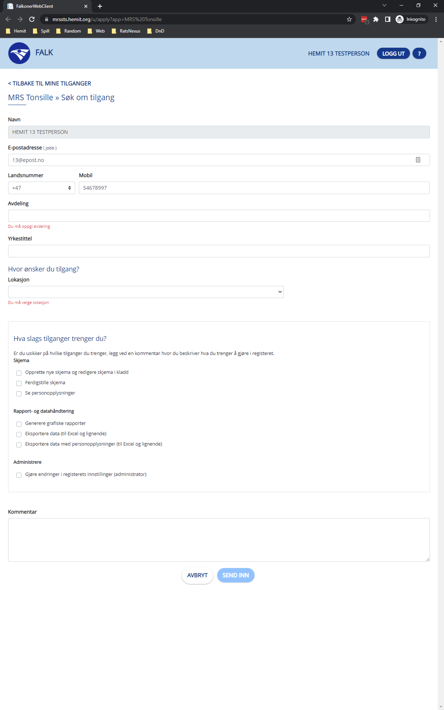
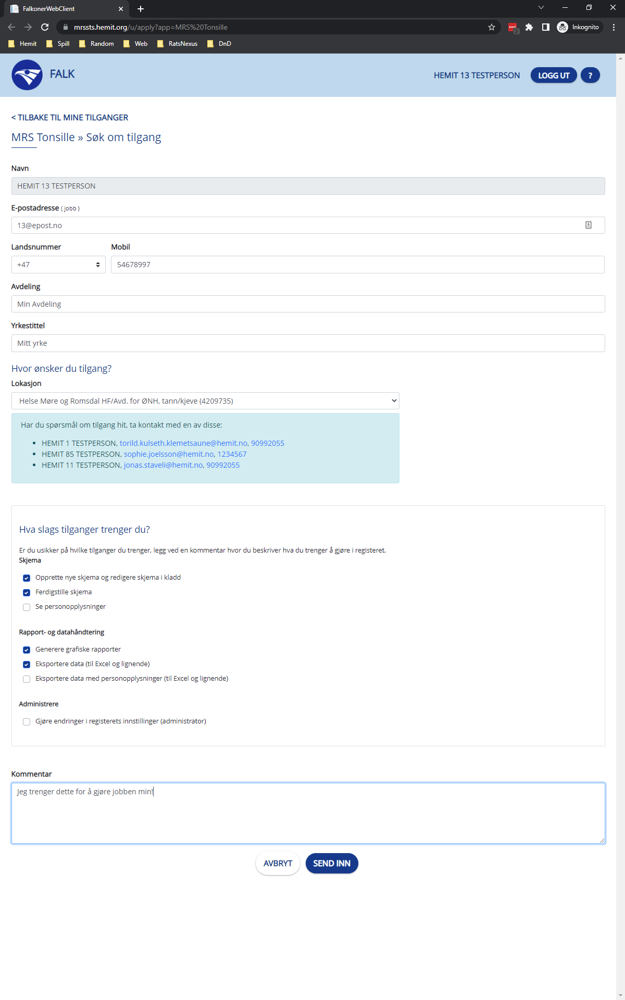
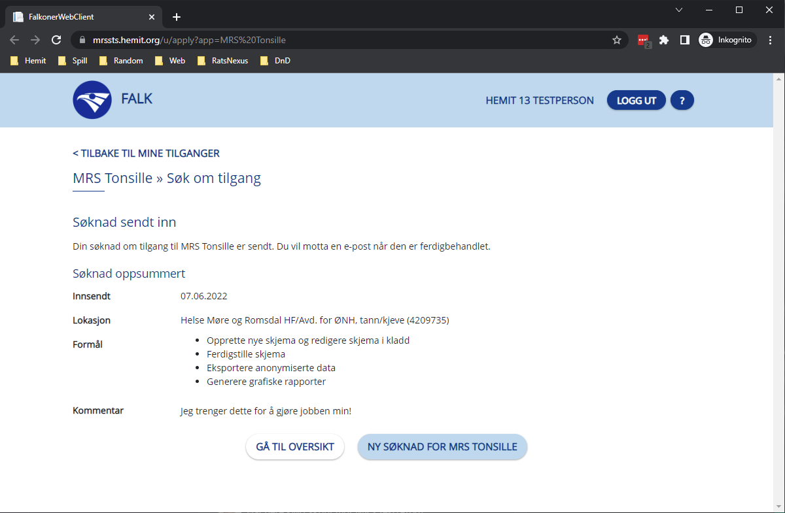

# Step-By-Step for Bruker
## Innlogging
[Klikk her for veiledning for innlogging.](LoggInn)

## Søk om tilgang
Når du går til et register du ikke har tilgang til kommer du til denne siden:

Her fyller du ut informasjon om hva du trenger for å informere Tilgangstildeleren om hvilke rolle de skal gi.

Deretter trykker du på "SEND INN".
Da får du opp en oversikt over søknaden som ble sent, samt at du får en e-post om at søknaden er sent til behandling.

Du kan da enten forlate siden og vente på en e-post som sier at søknaden har blitt besvart, eller så kan du trykke "GÅ TIL OVERSIKT" for å gå til Falk eller "NY SØKNAD FOR \<APPLIKASJON\>" hvis du trenger flere tilganger.
## Falk generelt

Når du er logget inn i falk kan du trykke på navnet ditt øverst i høyere hjørne for å gå til din bruker profil, beskrevet lenger nede.

Til høyere for navnet ditt er Logg ut knappen, som du kan bruke for å logge ut.

Til høyere for det igjen er "?" knappen, den åpner denne dokumentajons siden i en ny fane.

## Registeroversikt
Registeroversikt er den første siden du kommer til i Falk. Det er en oversikt over alle applikasjonene som finnes i Falk.
De er delt inn i kategorier og er søkbare. Du har også mulighet til å trykke på stjernen ved siden av applikasjonesnavnet og merke den som en favoritt.

## Mine tilganger
Under Mine tilganger får du en oversikt over hvilke applikasjoner du har tilgang til og hvilke tilganger det er. Du har også muligheten til å søke om ny tilgang til en applikasjon.

## Mine søknader
Under Mine søknader får du en oversikt over søknader du har sendt. Hvor og når du søkte samt status. Hvis den er behandlet så står det når det skjedde og hvis den ble avvist med en kommentar vi den også stå her. 

## Min aktivitet
Under Min aktivitet vil du se all aktiviteten din i Falk. Det inkluderer rettigheter som er lagt til, endret eller slettet og av- og på-logginger på applikasjoner.

## Bruker profil
På din bruker profil vil du se din kontakt info, og dine tilganger i plain tekst. Du har mulighet til å endre din kontakt informasjon og om du vil ha e-post varsling på eller av.
Hvis du slår av e-post varsling vil du ikke motta e-post om behandlede søknader.

