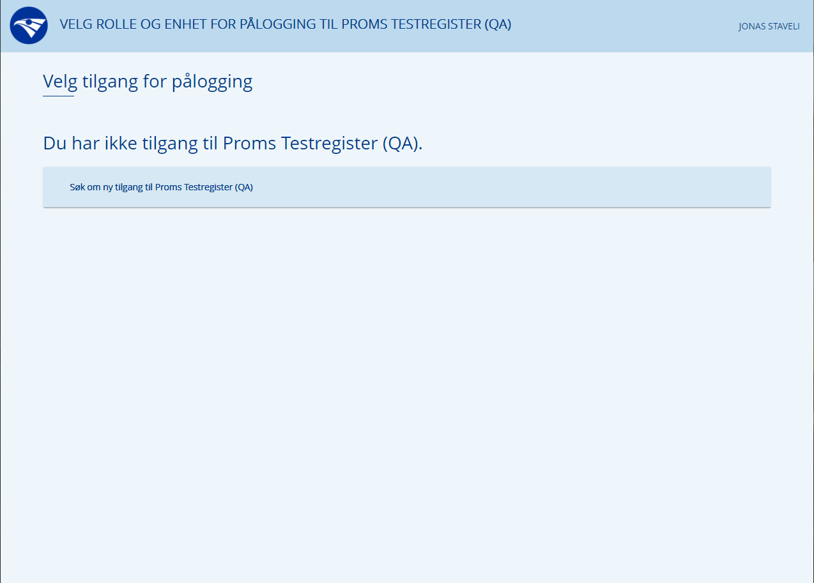
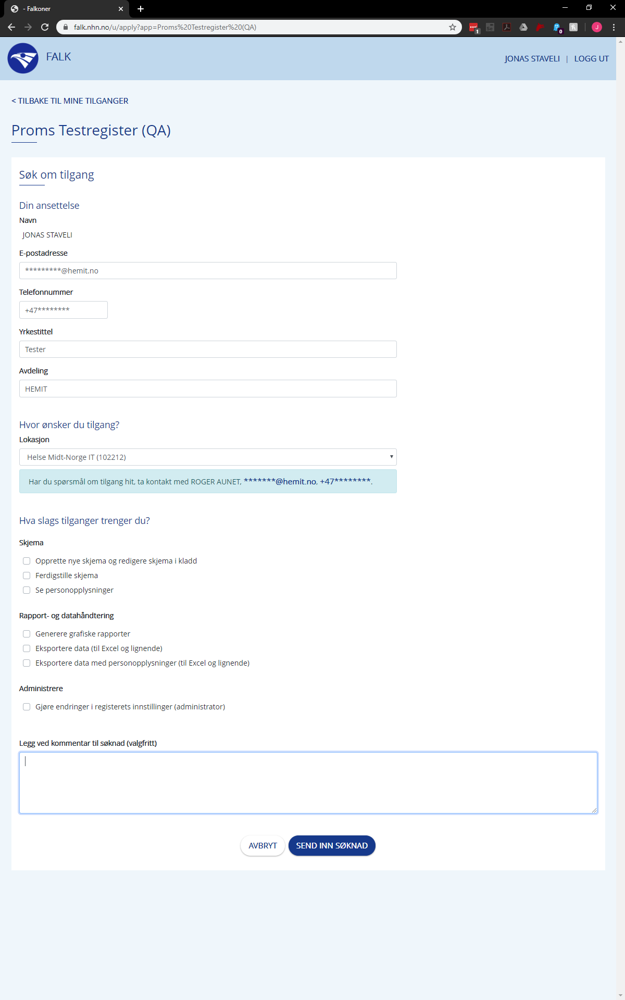
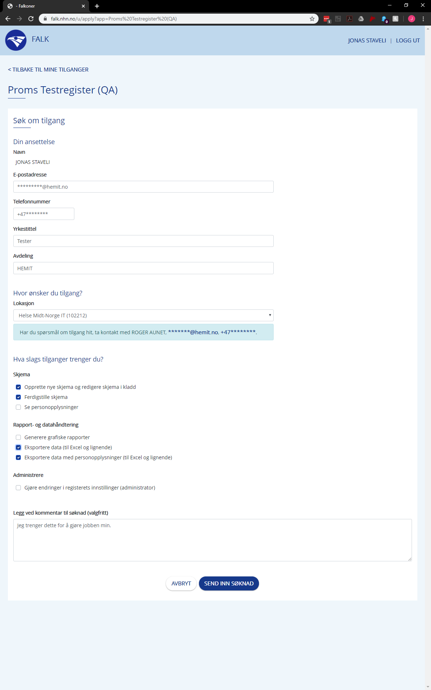
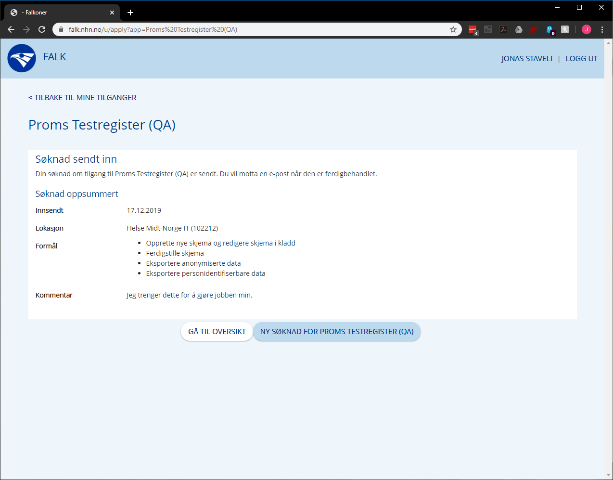
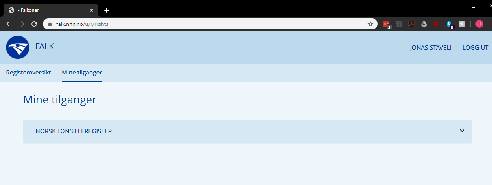
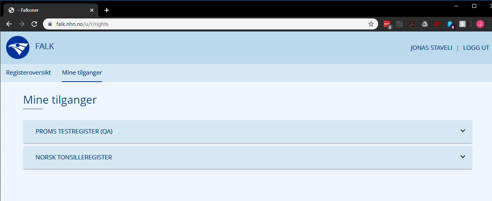

# Step-By-Step for Bruker

[Klikk her for veiledning for innlogging.](LoggInn.md)

Når du går til et register du ikke har tilgang til, eller har flere tilganger til, kommer du til denne siden:

Her kan du velge en tilgang, eller i dette tilfellet hvor du ikke har noen tilganger fra før velge å søke om tilgang.

Når du trykker på ""Søk om ny tilgang til \<Registeret\>" kommer du til en søknad der noen av feltene er fylt ut automatisk.

Her fyller du ut informasjon om hva du trenger for å informere Tilgangstildeleren om hvilke rolle de skal gi.

Deretter trykker du på "SEND INN SØKNAD".
Da får du opp en oversikt over søknaden som ble sent, samt at du får en e-post om at søknaden er sent til behandling.

Du kan da enten forlate siden og vente på en e-post som sier at søknaden har blitt besvart, eller så kan du trykke "GÅ TIL OVERSIKTEN" og så til "Mine Tilganger" for å se alle dine tilganger.
Før og etter søknaden ble godkjent:

