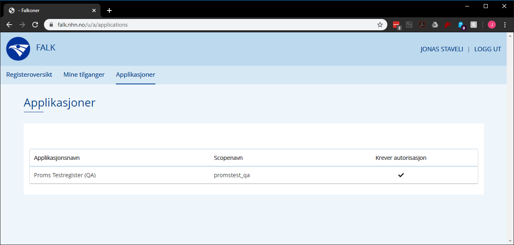
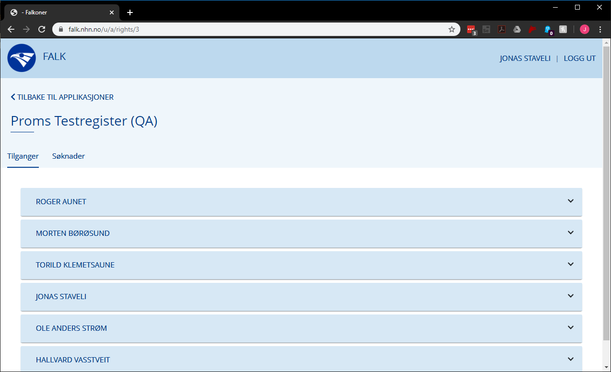
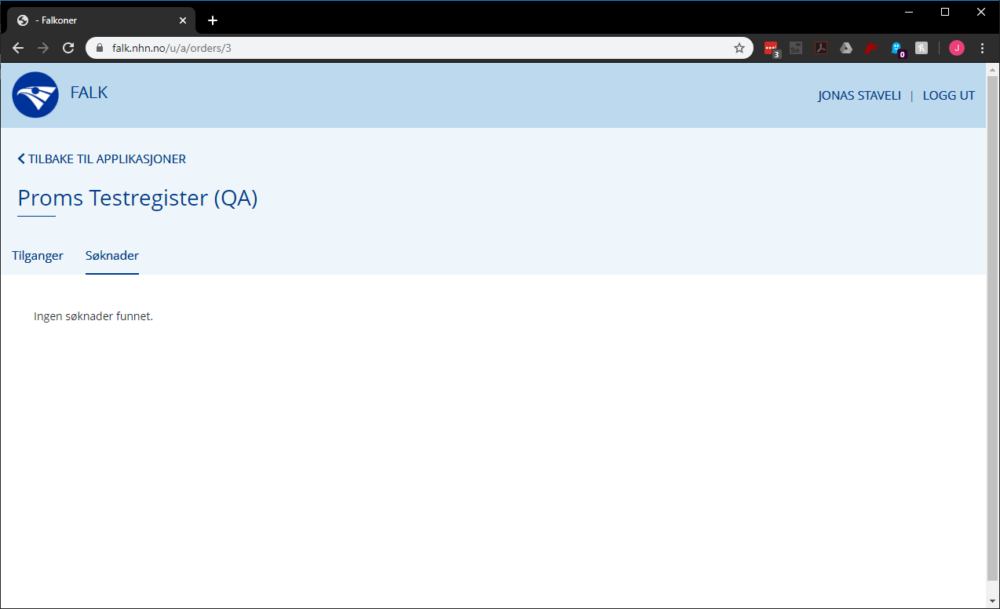
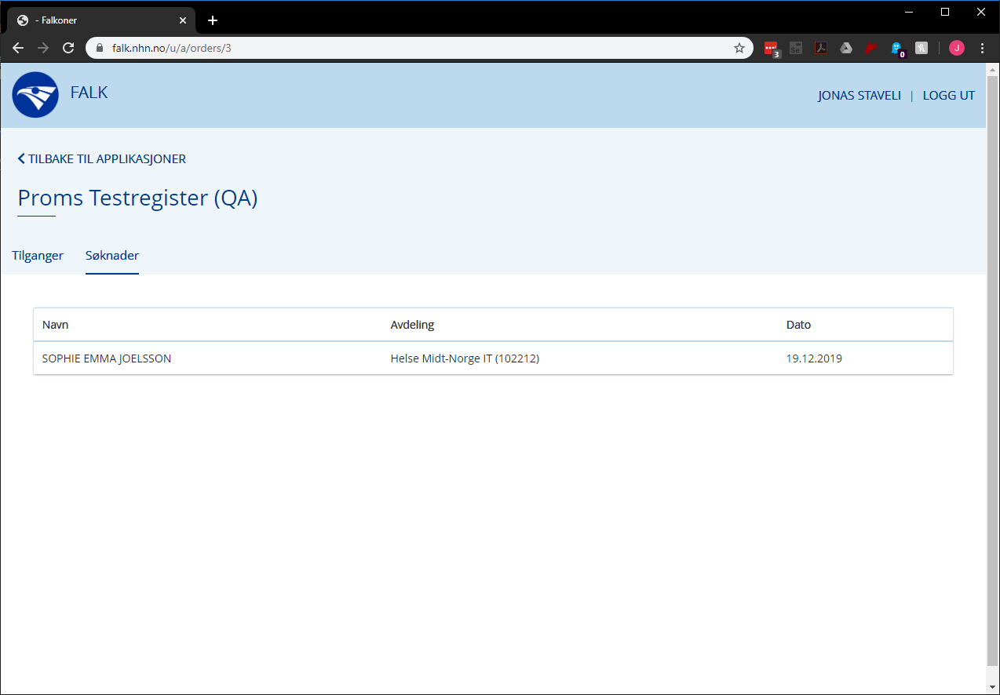
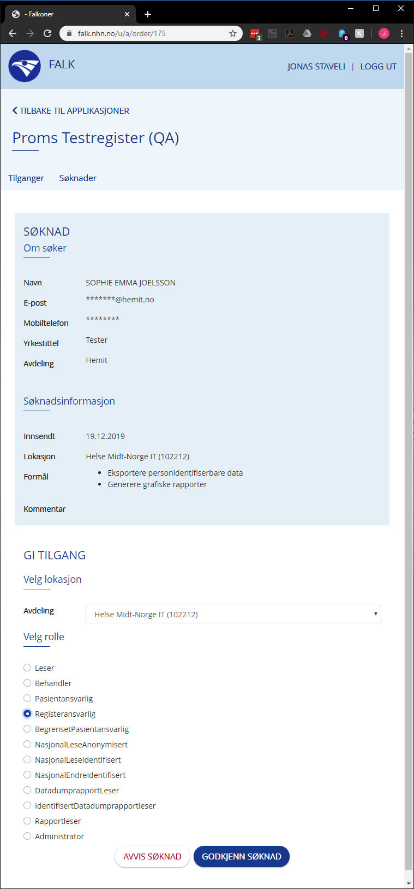
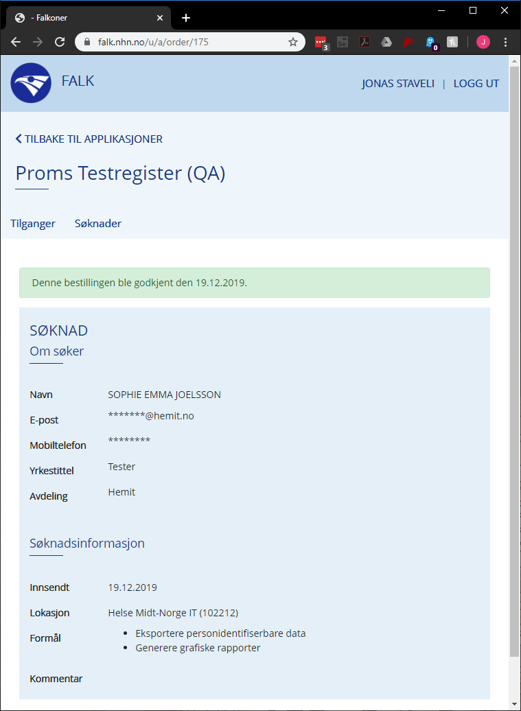
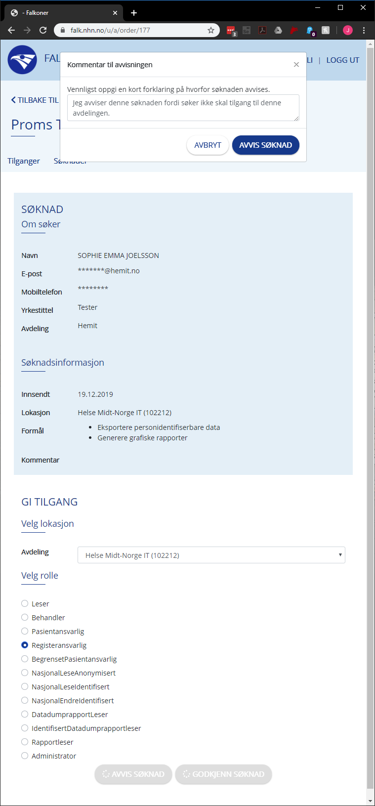
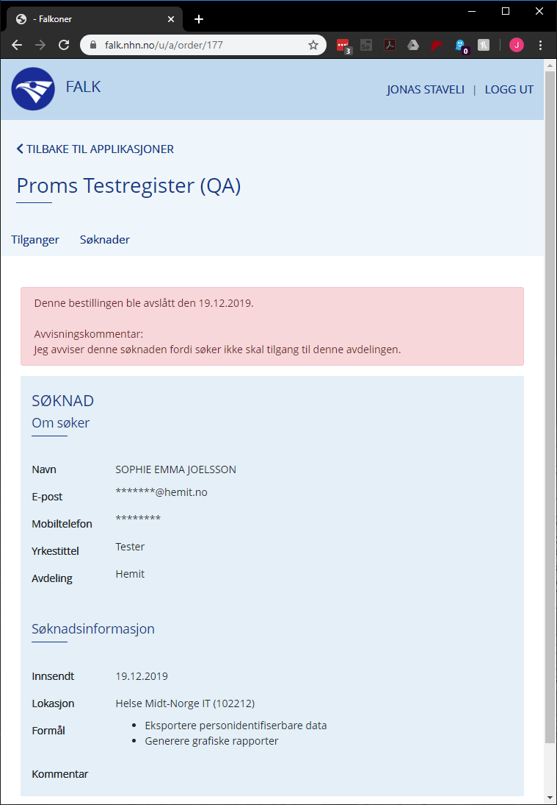

# Step-By-Step for Tilgangstildeler

[Veileding for inn logging.](LoggInn.md)

Som Tilgangstildeler har du en fane som heter Applikasjoner.  
Her finner du en liste over alle applikasjonene du har Tilgangstildeler rollen for.

Når du trykker seg inn på applikasjonen vil du kunne se hvem som har tilgang til applikasonen og nye søknader som må behandles.

---

Når det er kommet inn en ny søknad vil du bli varslet om det via en epost og du kan se det under søknader fanen.

Når du trykker på søknaden får du se informasjon om brukeren og hva de har søkt om.
Deretter har du valget over hvilke avdeling du vil gi søkeren tilgang og hvilke rolle de skal få.

Når du trykker "GODKJENN SØKNAD" får du en bekreftelse på handlingen.

Hvis du trykker "AVVIS SØKNAD" vil du få opp et lite vindu hvor du skriver inn en begrunnelse for avvisningen og får derretter en bekreftelse på handlingne.

