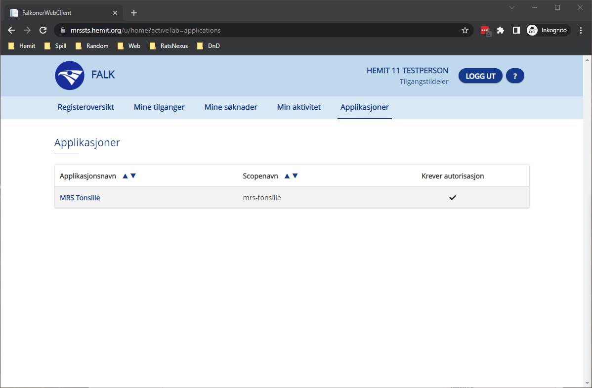

# Step-By-Step for Tilgangstildeler

[Klikk her for veiledning for innlogging.](LoggInn)

Som Tilgangstildeler har du en fane som heter Applikasjoner.  
Her finner du en liste over alle applikasjonene du har Tilgangstildeler rollen for.

## Søknader
Når du går inn på en applikasjon kommer du til en liste av søknader som er kommet inn på applikasjonen.
Du ser navnet på personen som har søkt, avdeling det er søkt på og dato for søknaden.

Når du åpner en søknad ved å trykke på "ÅPNE SØKNAD" får du opp en oversikt over søknaden som inneholder all informasjonen som ble lagt i den.
Utifra informasjonen velger du en rolle/ avdelings-kominasjon som bruker trenger og trykker "LEGG TIL".
Deretter har du mulighet til å legge til flere rolle/ avdelings-kominasjon hvis bruker trenger det.

"AVVIS SØKNAD" gir deg mulighet til å legge inn en kommentar på hvorfor den ble avvist.
"SLETT SØKNAD" vil slette søknaden. Dette er brukt for å fjerne duplikat søknader uten å trenge å avvise de.
"GODKJENN SØKNAD" vil godkjenne søknaden. Du må ha lagt til minst en rolle/ avdelings-kombinasjon.

## Tilgang
Under Tilgang fanen har du en oversikt over alle brukere som har tilgang til applikasjonen.
Ved å trykke på en bruker i listen utvides den til å vise hvlike tilganger den brukeren har og muligheter til å administrere tilgangene ved å trykke på "AMDINISTRER TILGANGER".

## Aktivitetslogg
Under aktivitetslogg fanen finer du en liste over alle aktivitet som er gjort på applikasonen.
