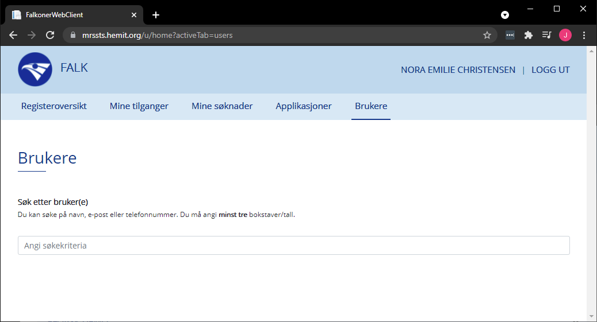
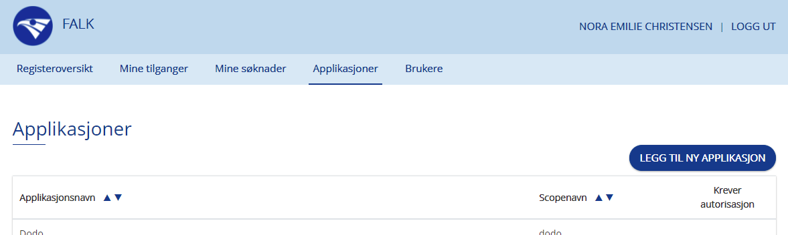
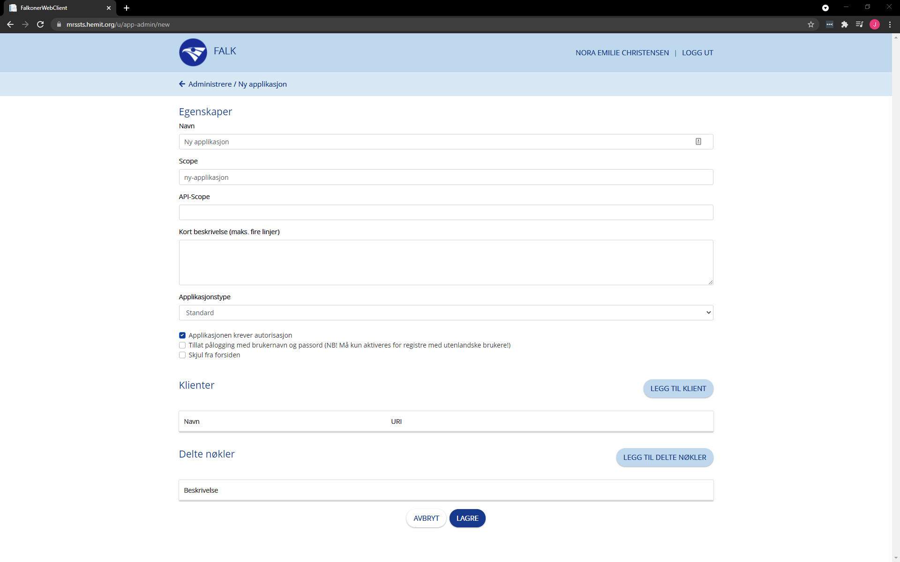
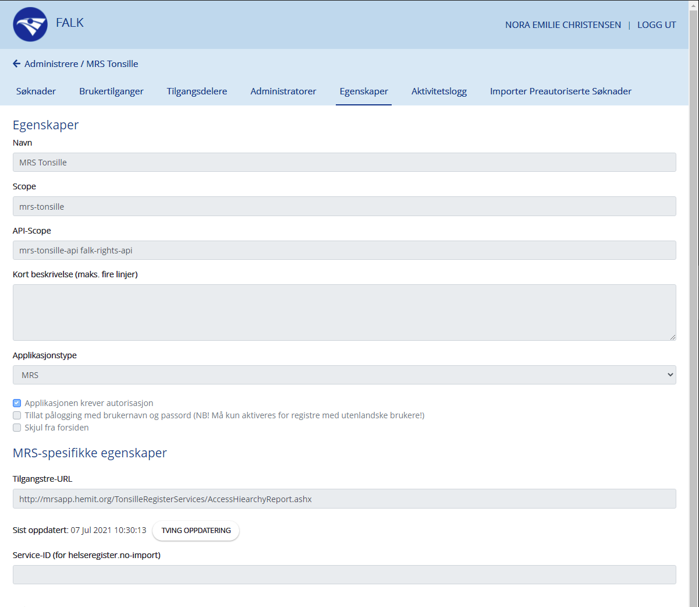
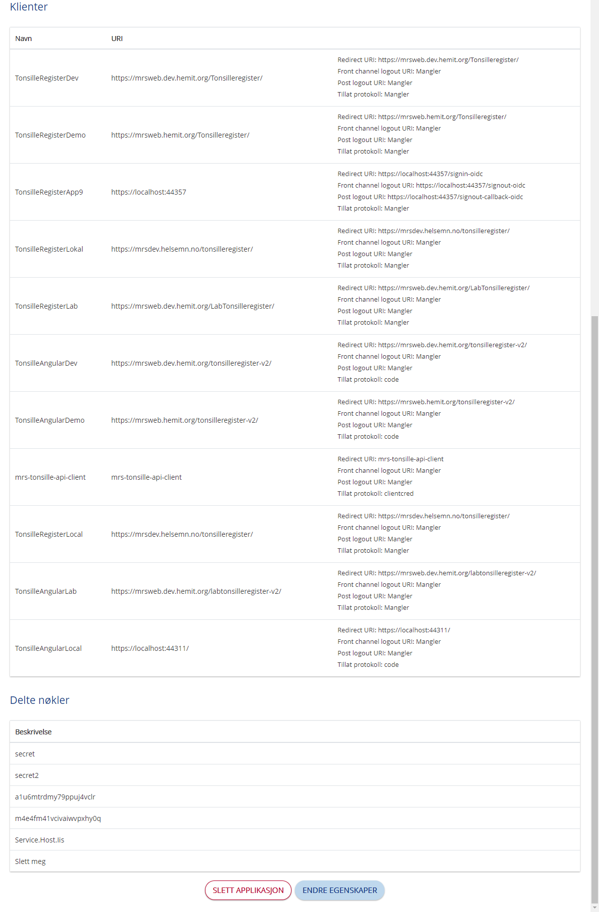

# Step-By-Step for Falk Admin

[Klikk her for veiledning for innlogging.](LoggInn)

Falk Admin har samme rettigheter som en [Applikasjonsadministrator](Brukerdokumentasjon-appliokasjonsadmin)

I tillegg har Falk Admin mulighet til å søke opp brukere blant alle brukerne i falk og opprette nye og redigere eksisterende applikasjoner.

## Brukere

Under Brukere fanen finner du et søke felt hvor du kan søke opp brukere i falk.
Du må skrive inn minst 3 tegn for å få et resultat.

## Legg Til Ny Applikasjon

Som Falk Admin har du en knapp over listen over applikasjoner under Aplikasjoner fanen.
Når du trykker på denn får du opp ett skjema som må fyles ut for å opprette en ny applikasjon.

## Egenskaper

Når du er inne på en applikasjon har du en fane som heter Egenskaper.
Denne viser egenskapene til applikasjonen. Disse kan redigeres i denne fanen.

