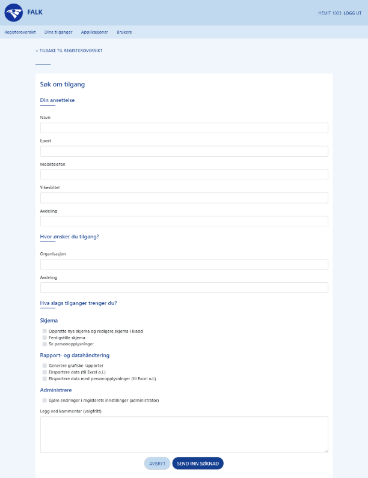
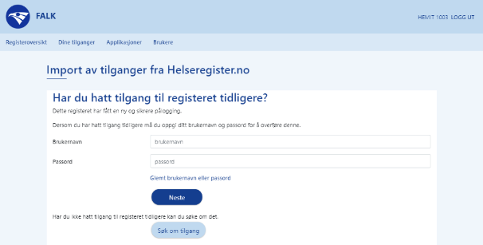

# Falk – Felles autentisering for kvalitetsregistre

## Pålogging til kvalitetsregistrene
Falk erstatter Helseregister.no, som ikke lengre oppfyller dagens krav til sikkerhet.

Falk sørger for at du får logget på alle kvalitetsregistrene i Norge på en sikker, trygg og enkel måte.

## Hvordan logger jeg på et register?
Besøk registeret slik du er vant til, f.eks. via [https://mrs.nhn.no/](https://mrs.nhn.no/)

Registeret vil logge deg på via Falk så sømløst som mulig, men vil kanskje be deg logge på via Id-porten (hvis vi ikke er sikre nok på hvem du er), og vil kanskje be deg velge tilgang (hvis du har flere tilganger).

## Hvordan får jeg som ny bruker tilgang til et register?

1. Besøk kvalitetsregisteret du ønsker tilgang til, f.eks. via [https://mrs.nhn.no/](https://mrs.nhn.no/)
2. Velg å søke om tilgang og fyll ut søknadsskjema

ELLER

1. Besøk Falk-forsiden på [https://falk.nhn.no/](https://falk.nhn.no/)
2. Velg registeret du ønsker tilgang til og trykk «Søk om tilgang»

## Jeg hadde tilgang før, hvordan får jeg den tilbake?

1. Besøk kvalitetsregisteret du ønsker tilgang til, f.eks. via [https://mrs.nhn.no/](https://mrs.nhn.no/)
2. Fyll ut påloggingsinformasjon dersom du blir bedt om det
3. Velg å importere fra Helseregister.no og følg instruksjonene 
   1. Du må benytte ditt gamle brukernavn og passord
   2. Du vil motta et engangspassord via SMS
