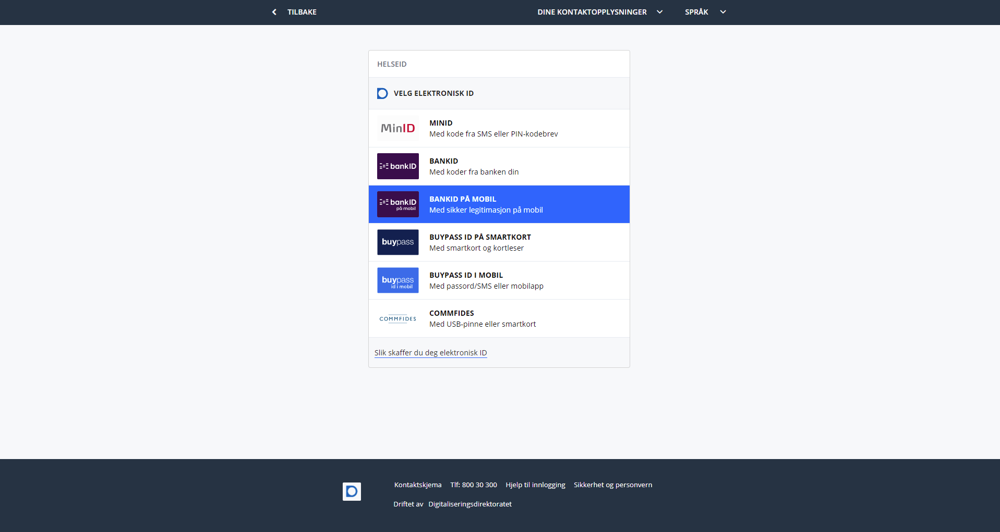
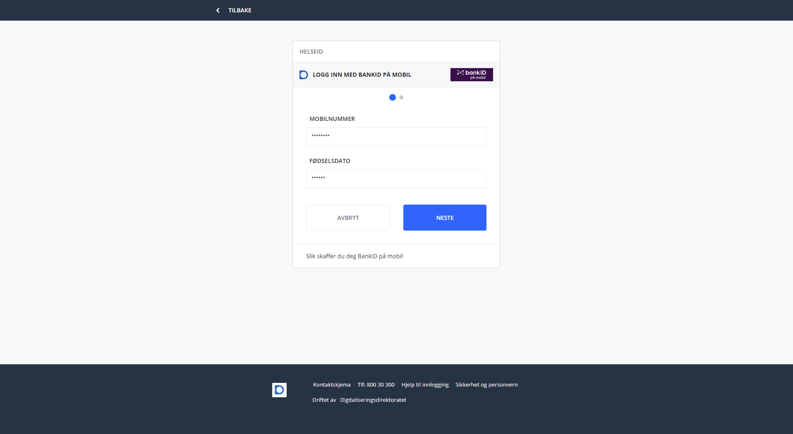
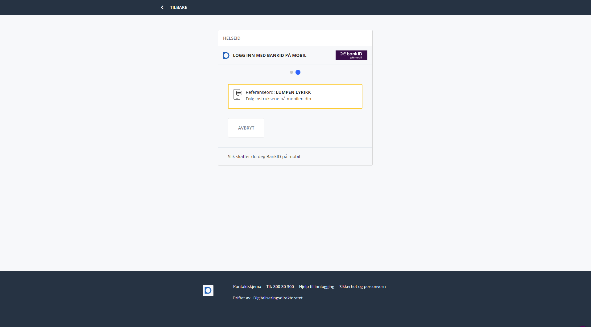
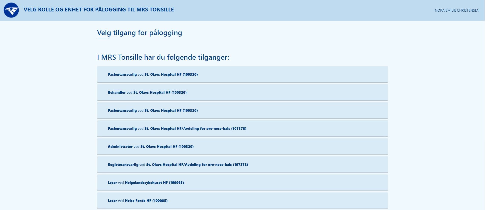

Hvis du ikke allerede er logget inn vil du komme til innloggingssiden.

Her trykker du på "ID-PORTEN".

Deretter trykker du på "BANKID" eller "BANKID PÅ MOBIL" og følger instruksene på skjermen.

Bankid på mobil vil bli brukt i resten av eksempelet.

Fyll ut telefonnummer og fødselsdato og trykk "NESTE".

Åpne mobilen og bekreft at referansen er lik den på skjermen og trykk ok og fyll inn din kode.

Etter dette er gjort er du logget inn!

Hvis du har flere roller i registeret vil du få opp en oversikt der du kan velge hvilke rolle du vil logge inn med.

