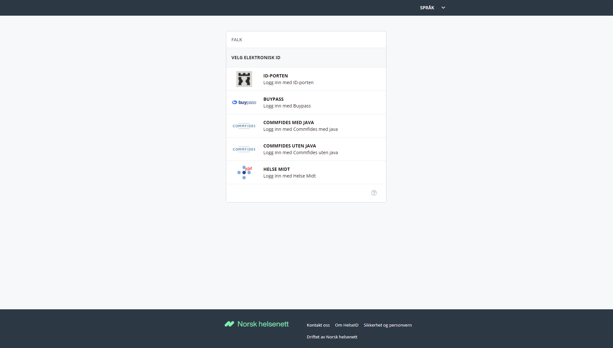

# FALK Brukerdokumentasjon

#  Veiledning for å logge inn i Falk

Hvis du ikke allerede er logget inn i Falk vil du få opp en innloggingsside.

På innloggingssiden vil det være en meny som viser forskjellige metoder du kan bruke for å logge inn. Velg den metoden du vil bruke for å logge inn ved å klikke på den. 

Dersom du logger inn via STS kan du velge ID-PORTEN. Hvis du velger ID-PORTEN som påloggingsmetode blir det åpnet en dialog der du velger den sikkerhetsmekanismen du vil bruke, for eksempel BankID eller BankID på mobil.

Hvis du velger BankID eller BankId på mobil vil du få instrukser på skjermen som du må følge. 

BankId på mobil er den påloggingsmetoden som er valgt i det følgende eksempelet: 
   

- I dialogen som vises på skjermen, fyll inn ditt mobiltelefonnummer og fødselsdatoen din i feltene, og velg Neste.
- På mobiltelefonen din, i meldingen som blir vist fra BankId, bekreft at referansen er lik den du ser på skjermen, velg OK og fyll inn din egen, personlige kode.

- Etter at du har fylt inn din personlige kode på skjemen, blir du logget inn. 
- Hvis du har mer enn en rolle i registeret vil du få opp en liste som viser rollene og enhetene du har tilgang til. 
- I listen som viser rollene, velg den rollen på den enheten som du vil logge inn med.

---
Mer informasjon og veiledere:

>[ Til forsiden i Falk brukerveiledning](README.md)

>[ Brukerveledning for App Admin](Brukerdokumentasjon-applikasjonsadmin.md)

>[ Brukerveledning for Bruker](Brukerdokumentasjon-bruker.md)

>[ Brukerveledning for Falk Administrator](Brukerdokumentasjon-falkadmin.md)

>[ Brukerveledning - M2M-klienter](Brukerdokumentasjon-m2m.md)

>[ Brukerveledning for Tilgangstildeler](Brukerdokumentasjon-tilgangstildeler.md)

>[ Til toppen av denne siden](#Veiledning-for-a-logge-inn-i-Falk)